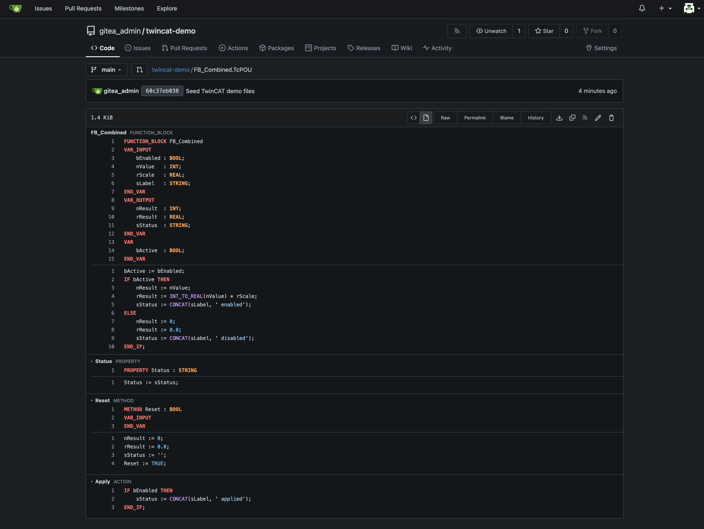
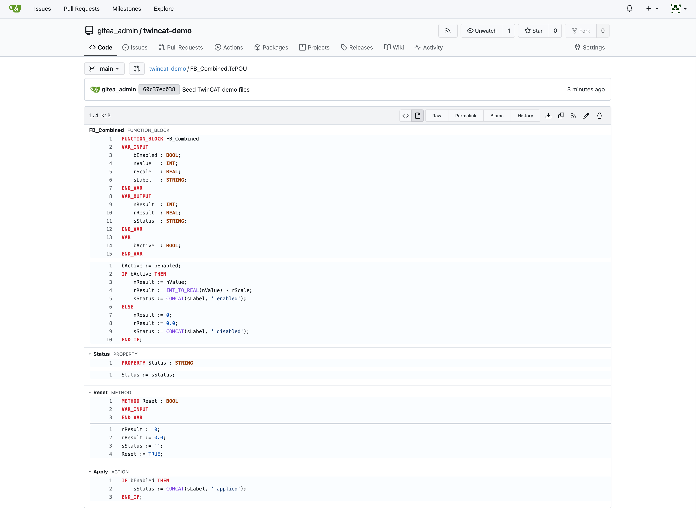
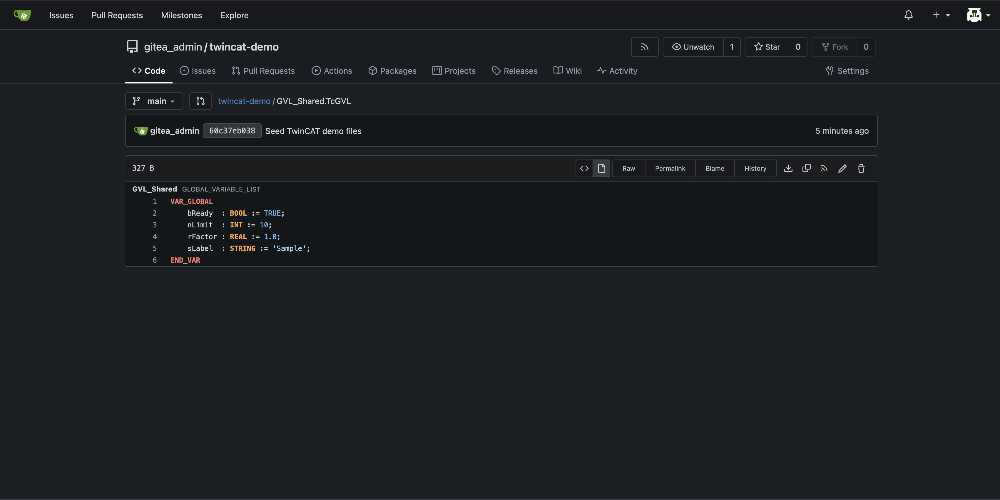
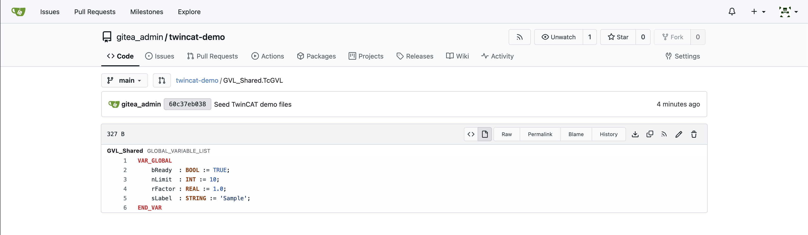

# gitea-twincat-viewer

`gitea-twincat-viewer` is a pure Go Gitea external renderer for Beckhoff
TwinCAT files. It turns the Structured Text in `POU`, `DUT`, and `GVL` files
into readable, syntax-highlighted HTML through a single static binary.

## Screenshots

| Dark theme | Light theme |
| --- | --- |
| <a href="docs/images/function-block-dark.png"></a> | <a href="docs/images/function-block-light.png"></a> |
| <a href="docs/images/global-variables-dark.png"></a> | <a href="docs/images/global-variables-light.png"></a> |

## Supported TwinCAT files

| Extension | Kind | Rendered content |
| --- | --- | --- |
| `.TcPOU` | POU | Name, kind, declaration, implementation, methods, properties, and actions |
| `.TcDUT` | DUT | Name, kind, and declaration |
| `.TcGVL` | GVL | Name and global variable declarations |

## Gitea configuration

Configure the renderer through Gitea's `app.ini`. The simplest approach is to
mount an additional `.ini` file into `/etc/gitea/app.ini.d/`.

For example, `deploy/gitea/app.ini.d/twincat.ini` can contain:

```ini
[markup.twincat]
ENABLED = true
FILE_EXTENSIONS = .TcPOU,.TcDUT,.TcGVL
RENDER_COMMAND = /opt/gitea-extensions/gitea-twincat-viewer
IS_INPUT_FILE = true
RENDER_CONTENT_MODE = no-sanitizer
```

### Helm

The binaries are published as raw assets in the versioned GitHub Releases for
this repository. Choose `gitea-twincat-viewer-linux-amd64` or
`gitea-twincat-viewer-linux-arm64` to match the Gitea host architecture. The
following values use an Alpine init container to download the selected release
asset into a shared `emptyDir`, install it at
`/opt/gitea-extensions/gitea-twincat-viewer`, and make it executable:

```yaml
# values.yaml
deployment:
  volumes:
    - name: twincat-extensions
      emptyDir: {}
  initContainers:
    - name: download-twincat-viewer
      image: alpine:3.22
      env:
        - name: RELEASE_VERSION
          value: X.Y.Z
        - name: ASSET
          value: gitea-twincat-viewer-linux-amd64
      command:
        - /bin/sh
        - -ec
        - |
          wget -O /opt/gitea-extensions/gitea-twincat-viewer \
            "https://github.com/dawidgora/gitea-twincat-viewer/releases/download/${RELEASE_VERSION}/${ASSET}"
          chmod +x /opt/gitea-extensions/gitea-twincat-viewer
      volumeMounts:
        - name: twincat-extensions
          mountPath: /opt/gitea-extensions
  gitea:
    volumeMounts:
      - name: twincat-extensions
        mountPath: /opt/gitea-extensions
        readOnly: true

gitea:
  config:
    "markup.twincat":
      ENABLED: true
      FILE_EXTENSIONS: .TcPOU,.TcDUT,.TcGVL
      RENDER_COMMAND: /opt/gitea-extensions/gitea-twincat-viewer
      IS_INPUT_FILE: true
      RENDER_CONTENT_MODE: no-sanitizer
```

### Docker Compose

For a normal Docker Compose installation, use a one-shot Alpine downloader and
share its named volume with Gitea. Replace `X.Y.Z` and the asset name as
needed for the Gitea host architecture:

```yaml
services:
  twincat-viewer-downloader:
    image: alpine:3.22
    environment:
      RELEASE_VERSION: X.Y.Z
      ASSET: gitea-twincat-viewer-linux-amd64
    command:
      - /bin/sh
      - -ec
      - |
        wget -O /opt/gitea-extensions/gitea-twincat-viewer \
          "https://github.com/dawidgora/gitea-twincat-viewer/releases/download/$${RELEASE_VERSION}/$${ASSET}"
        chmod +x /opt/gitea-extensions/gitea-twincat-viewer
    volumes:
      - twincat-extensions:/opt/gitea-extensions

  gitea:
    image: gitea/gitea:latest
    depends_on:
      twincat-viewer-downloader:
        condition: service_completed_successfully
    ports:
      - "3000:3000"
      - "2222:22"
    volumes:
      - gitea-data:/data
      - twincat-extensions:/opt/gitea-extensions:ro
    environment:
      GITEA__markup__twincat__ENABLED: "true"
      GITEA__markup__twincat__FILE_EXTENSIONS: ".TcPOU,.TcDUT,.TcGVL"
      GITEA__markup__twincat__RENDER_COMMAND: /opt/gitea-extensions/gitea-twincat-viewer
      GITEA__markup__twincat__IS_INPUT_FILE: "true"
      GITEA__markup__twincat__RENDER_CONTENT_MODE: no-sanitizer

volumes:
  gitea-data:
  twincat-extensions:
```

Open an issue if you need instructions for another installation method.

## Support

[](https://buymeacoffee.com/dawidgora)
